# Istio Service Mesh for Kubernetes Microservices

## Prerequisites

To follow along with this tutorial, you'll need:

- kubectl installed and configured ([https://youtu.be/IBkU4dghY0Y](https://youtu.be/IBkU4dghY0Y))
- Helm installed: ([https://rslim087a.github.io/rayanslim/lesson.html?course=prometheus-grafana-monitoring-course&lesson=helm-installation](https://rslim087a.github.io/rayanslim/lesson.html?course=prometheus-grafana-monitoring-course&lesson=helm-installation))


Service mesh allow to monitor comunication between microservices. 

This project demonstrates how to deploy a complete **service mesh** using **Istio** on a local **Kind Kubernetes cluster**.

You will learn how to implement:

- 🔍 **Observability** (Kiali, Grafana, Prometheus)
- 🌐 **Traffic routing** (Gateway, VirtualService)
- 🔐 **mTLS encryption**
- 🌓 **Canary deployments**
- 🛡️ **Circuit breaking**
- 📈 **Distributed tracing** (Jaeger, Zipkin)

The demo uses a full **e‑commerce microservices application** to visualize real traffic flowing through the mesh.

# Project Structure

<div align="center">
  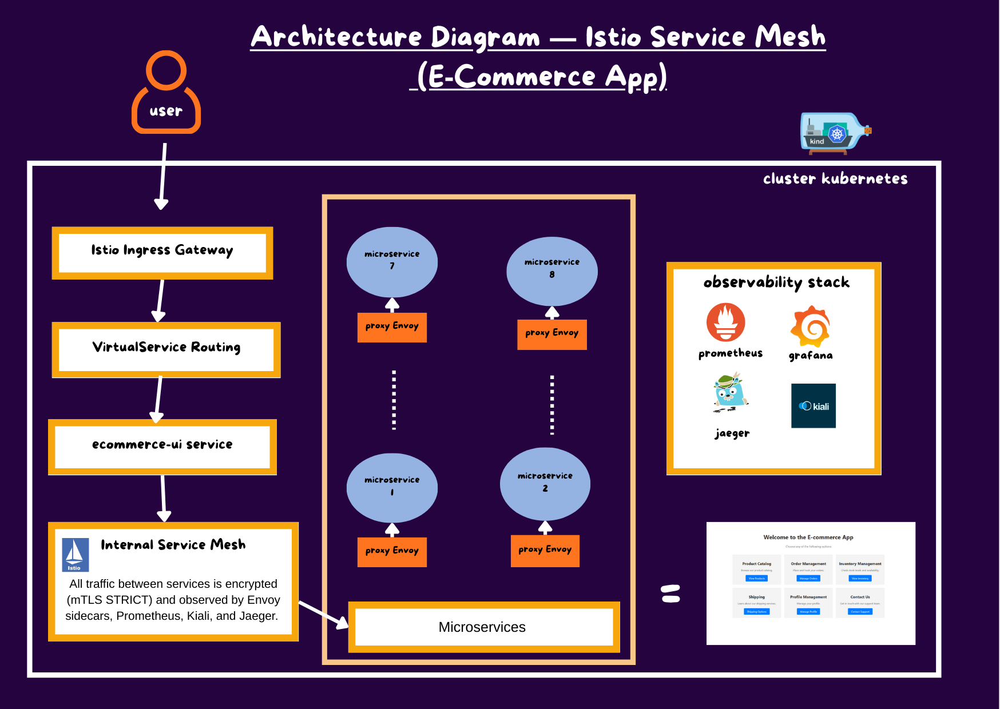
</div>

# 1.Installation

### Clone the project

```bash
git clone: https://github.com/fleury12/istio-service-mesh-kubernetes-kiali-grafana.git
cd istio-service-mesh-kubernetes-kiali-grafana/
```

### Cluster creation

Install Kind if needed:

https://kind.sigs.k8s.io/docs/user/quick-start/#installation

```bash
$ kind create cluster --name my-cluster
Creating cluster "my-cluster" ...
 ✓ Ensuring node image (kindest/node:v1.34.0) 🖼
 ✓ Preparing nodes 📦
 ✓ Writing configuration 📜
 ✓ Starting control-plane 🕹️
 ✓ Installing CNI 🔌
 ✓ Installing StorageClass 💾
Set kubectl context to "kind-my-cluster"
You can now use your cluster with:

kubectl cluster-info --context kind-my-cluster

Not sure what to do next? 😅  Check out https://kind.sigs.k8s.io/docs/user/quick-start/
```

### Install istio

you need to have Helm installed

```bash
kubectl create namespace istio-system
helm repo add istio https://istio-release.storage.googleapis.com/charts
helm repo update
helm install istio-base istio/base -n istio-system --set defaultRevision=default 
helm install istiod istio/istiod -n istio-system --wait
kubectl get deployments -n istio-system --output wide
helm install istio-ingressgateway istio/gateway -n istio-system

```

Verify that everything install correctly.

```bash
$ kubectl get pods -n istio-system
NAME                                    READY   STATUS    RESTARTS   AGE
istio-ingressgateway-5448c79d6b-dgfrd   1/1     Running   0          3m46s
istiod-b9f66b66c-lm2l6                  1/1     Running   0          8m26s
$ kubectl get svc -n istio-system
NAME                   TYPE           CLUSTER-IP     EXTERNAL-IP   PORT(S)                                      AGE
istio-ingressgateway   LoadBalancer   10.96.72.176   <pending>     15021:30644/TCP,80:30209/TCP,443:30607/TCP   3m51s
istiod                 ClusterIP      10.96.49.44    <none>        15010/TCP,15012/TCP,443/TCP,15014/TCP        8m31s
```

As we don’t have Lod balancing function in KIND CLUSTER, we will use nodeport. Then pact the service as follow

```bash
$ kubectl patch svc istio-ingressgateway -n istio-system \
  -p '{"spec": {"type": "NodePort"}}'
```

Install istio add-ons 

KIALI: visualise everything in service mesh

GRAFANA and PROMETHEUS: observability

```bash
mkdir -p istio-addons
curl -L https://raw.githubusercontent.com/istio/istio/release-1.25/samples/addons/prometheus.yaml -o istio-addons/prometheus.yaml
curl -L https://raw.githubusercontent.com/istio/istio/release-1.25/samples/addons/grafana.yaml -o istio-addons/grafana.yaml
curl -L https://raw.githubusercontent.com/istio/istio/release-1.25/samples/addons/kiali.yaml -o istio-addons/kiali.yaml
curl -L https://raw.githubusercontent.com/istio/istio/release-1.25/samples/addons/jaeger.yaml -o istio-addons/jaeger.yaml

#create telemetry resource to send trace to jaerger
vi istio-addons/jaeger-tracing.yaml
apiVersion: telemetry.istio.io/v1
kind: Telemetry
metadata:
  name: mesh-default
  namespace: istio-system
spec:
  tracing:
  - providers:
    - name: zipkin
    randomSamplingPercentage: 100

kubectl apply -f istio-addons/prometheus.yaml
kubectl apply -f istio-addons/grafana.yaml
kubectl apply -f istio-addons/kiali.yaml
kubectl apply -f istio-addons/jaeger.yaml
kubectl apply -f istio-addons/jaeger-tracing.yaml
```

### Create ecommerce namespace and enable istio-injection

```bash
kubectl create namespace ecommerce
kubectl label namespace ecommerce istio-injection=enabled  # this line allow to have a sidecar container as envoy proxy container for each pod deployed in this namespace 
```

### Deploy app

```bash
kubectl apply -f microservices/

#verify installation
kubectl get all -n ecommerce
NAME                                         READY   STATUS    RESTARTS   AGE
pod/contact-support-team-75cb5dfbc4-f6bb4    2/2     Running   0          3m45s
pod/ecommerce-ui-5554ddb568-68wtj            2/2     Running   0          3m46s
pod/order-management-5f8c58ffc6-4msml        2/2     Running   0          3m46s
pod/product-catalog-66489c6df9-2rsxb         2/2     Running   0          3m46s
pod/product-inventory-855c57579-4zb44        2/2     Running   0          3m46s
pod/profile-management-698977c54f-rrb2b      2/2     Running   0          3m45s
pod/shipping-and-handling-7cb86f56f8-xlxmb   2/2     Running   0          3m45s

NAME                            TYPE        CLUSTER-IP      EXTERNAL-IP   PORT(S)    AGE
service/contact-support-team    ClusterIP   10.96.239.24    <none>        8000/TCP   3m45s
service/ecommerce-ui            ClusterIP   10.96.157.148   <none>        4000/TCP   3m46s
service/order-management        ClusterIP   10.96.39.44     <none>        9090/TCP   3m46s
service/product-catalog         ClusterIP   10.96.246.30    <none>        3001/TCP   3m46s
service/product-inventory       ClusterIP   10.96.39.28     <none>        3002/TCP   3m46s
service/profile-management      ClusterIP   10.96.99.226    <none>        3003/TCP   3m45s
service/shipping-and-handling   ClusterIP   10.96.48.152    <none>        8080/TCP   3m45s

NAME                                    READY   UP-TO-DATE   AVAILABLE   AGE
deployment.apps/contact-support-team    1/1     1            1           3m45s
deployment.apps/ecommerce-ui            1/1     1            1           3m46s
deployment.apps/order-management        1/1     1            1           3m46s
deployment.apps/product-catalog         1/1     1            1           3m46s
deployment.apps/product-inventory       1/1     1            1           3m46s
deployment.apps/profile-management      1/1     1            1           3m46s
deployment.apps/shipping-and-handling   1/1     1            1           3m45s

NAME                                               DESIRED   CURRENT   READY   AGE
replicaset.apps/contact-support-team-75cb5dfbc4    1         1         1       3m45s
replicaset.apps/ecommerce-ui-5554ddb568            1         1         1       3m46s
replicaset.apps/order-management-5f8c58ffc6        1         1         1       3m46s
replicaset.apps/product-catalog-66489c6df9         1         1         1       3m46s
replicaset.apps/product-inventory-855c57579        1         1         1       3m46s
replicaset.apps/profile-management-698977c54f      1         1         1       3m45s
replicaset.apps/shipping-and-handling-7cb86f56f8   1         1         1       3m45s

```

# 2. Istio gateway, virtueliservice é MTLS encryption

### Gateway

The frontend of our microservice is ecommerce-ui. Then the the entry point will be a gateway resource. Then the trafic will be redirected to other microservice. It acts like a ingress and a front door for our app. all the trafic will pass throur this gateway before arriving to other microservice.

```bash
apiVersion: networking.istio.io/v1alpha3
kind: Gateway
metadata:
  name: ecommerce-gateway
  namespace: ecommerce
spec:
  selector:
    istio: ingressgateway # use Istio's default ingress gateway
  servers:
  - port:
      number: 80  # we will acces our app trour this port (gateway)
      name: http
      protocol: HTTP
    hosts:
    - "*"   #from any location
# The Gateway creates the entry point for external traffic
```

### The virtualservice

Define how trafic is routed in our service

```bash
# VirtualService for external access
apiVersion: networking.istio.io/v1alpha3
kind: VirtualService
metadata:
  name: ecommerce-gateway-routes
  namespace: ecommerce
spec:
  hosts:
  - "*" # allow all trafic from gateway with http request and prefix / to reach ecommerce on port 4000-ui
  gateways:
  - ecommerce-gateway
  http:
  - match:
    - uri:
        prefix: /
    route:
    - destination:
        host: ecommerce-ui 
        port:
          number: 4000   #the reques wil reach the entry point of our application
```

### Mtls encryption

In the context of envoy proxy container, every request that go in or out of the container will be intercepet by the envoy proxy. In our case,  comunication should be encrypted . then,  mtls ecryption is a protocol that can verify the indentity of each service to secure comunication between two service by verifiyng digital certificate. All of this is done by envoy container running on each pod

```bash
apiVersion: security.istio.io/v1beta1
kind: PeerAuthentication
metadata:
  name: default
  namespace: ecommerce
spec:
  mtls:
    mode: STRICT

# Secures all internal communication, can check in Kiali
```

# 3. Access application

```bash
#get services
$ kubectl get svc -n istio-system
NAME                   TYPE        CLUSTER-IP      EXTERNAL-IP   PORT(S)                                      AGE
grafana                ClusterIP   10.96.169.206   <none>        3000/TCP                                     28m
istio-ingressgateway   NodePort    10.96.72.176    <none>        15021:30644/TCP,80:30209/TCP,443:30607/TCP   56m
istiod                 ClusterIP   10.96.49.44     <none>        15010/TCP,15012/TCP,443/TCP,15014/TCP        61m
kiali                  ClusterIP   10.96.249.109   <none>        20001/TCP,9090/TCP                           27m
prometheus             ClusterIP   10.96.209.4     <none>        9090/TCP                                     28m

#port-forwarding
$ kubectl port-forward -n istio-system svc/istio-ingressgateway 8080:80 > /dev/null 2>&1 &

```

Open:

```bash
http://localhost:8080
```

<div align="center">
  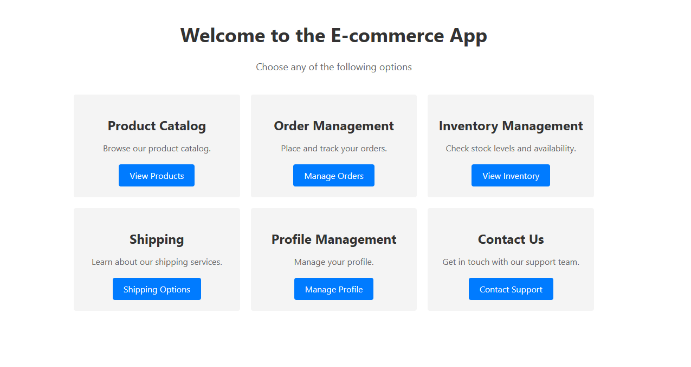
</div>

<div align="center">
  
</div>

Then generate trafic by adding items in your card

### Visualize Traffic with Kiali

```bash
kubectl port-forward -n istio-system svc/kiali 20001:20001 > /
dev/null 2>&1 &
```

Open:  localhost:20001

You can now see:
- service graph
- request flows
- mTLS status
- routing rules
- canary traffic distribution

<div align="center">
  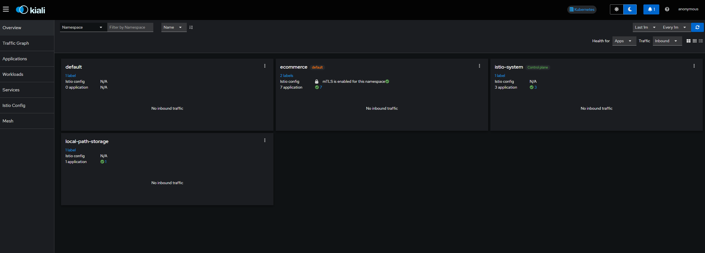
</div>

Go to application to see all services. We see that all of them have Peer Authentication ( PA) Healthy.

For the ecommerce-ui service, we can see “ecommerce-gateway-route”  because of the virtualservice we implenented before.

<div align="center">
  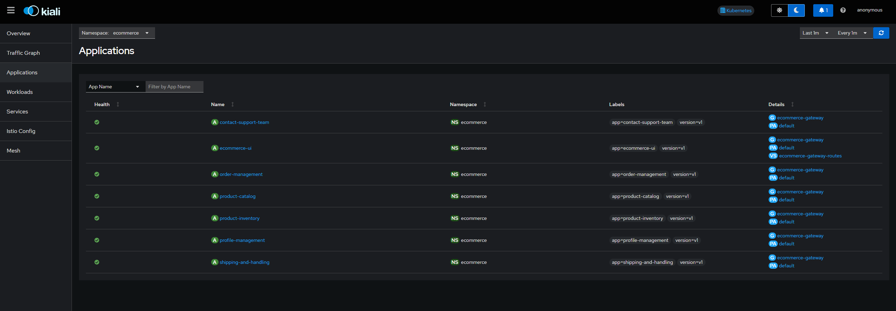
</div>

Genarate trafic on the ecommerce site an goback top see tworkload in kiali.

Got to Workload→ecommerce-ui. if you don’t anything click LAST→select 10 or 15 min

<div align="center">
  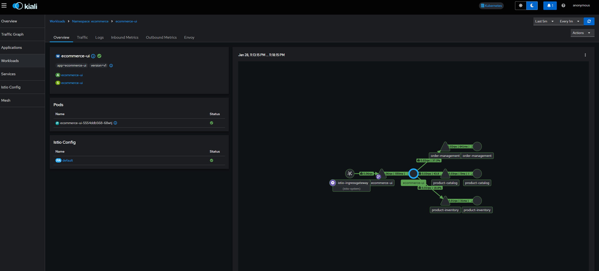
</div>

By seing the graph we can see how the request go from one service to another. click on other service to see heir graph.

# 4. Canary deployment

This strategy of deployment allow to test a new version of the app on a percentage of user and increase widedly until 100% of the user get the new [version.](http://version.In)  If some errors a are detect during the deployment, the impact is low. Just an low percentage of user are affected and a rollingback is done. The trafic is redirect to the old version.

In our case we will deploy a new version of our product-catalog app.

Keep in mind that the product-catalog service selector is “product-catalog”. then, the service will route trafic through all pods with this labels. 

```bash
#canary deployment 
apiVersion: apps/v1
kind: Deployment
metadata:
  name: product-catalog-v2
  namespace: ecommerce
spec:
  replicas: 1
  selector:
    matchLabels:
      app: product-catalog
      version: v2
  template:
    metadata:
      labels:
        app: product-catalog
        version: v2
    spec:
      containers:
      - name: product-catalog
        image: rslim087/product-catalog:2.0.0
        ports:
        - containerPort: 3001
        env:
        - name: MONGODB_HOST
          value: "mongodb-product-catalog"
        - name: MONGODB_PORT
          value: "27017"
        - name: MONGODB_DATABASE
          value: "product_catalog"
#this new version of product-catalog use a mongodb 
---
#this is the mongodb deployment
apiVersion: apps/v1
kind: Deployment
metadata:
  name: mongodb-product-catalog
  namespace: ecommerce
spec:
  replicas: 1
  selector:
    matchLabels:
      app: mongodb-product-catalog
      version: v1
  template:
    metadata:
      labels:
        app: mongodb-product-catalog
        version: v1
    spec:
      containers:
      - name: mongodb-product-catalog
        image: mongo:6.0
        ports:
        - containerPort: 27017
---
#this in the service of our mongodb-product-catalog
apiVersion: v1
kind: Service
metadata:
  name: mongodb-product-catalog
  namespace: ecommerce
spec:
  ports:
  - port: 27017
  selector:
    app: mongodb-product-catalog
---
# this resource allow to group pods an use to target them defferently 
apiVersion: networking.istio.io/v1alpha3
kind: DestinationRule
metadata:
  name: product-catalog
  namespace: ecommerce
spec:
  host: product-catalog  #find all the pods with label product-catalog
  subsets:
  - name: v1  # create group v1
    labels:
      version: v1 # with product-catalog pod that have the label v1
  - name: v2 # create group v2
    labels:
      version: v2 # with product-catalog pod that have the label v2
---
# this virtual service is like an ingress. It will distribute the trafic between thes versions
apiVersion: networking.istio.io/v1alpha3
kind: VirtualService
metadata:
  name: product-catalog
  namespace: ecommerce
spec:
  hosts:
  - product-catalog
  http:
  - route:
    - destination:
        host: product-catalog
        subset: v1 # the subset is t
      weight: 80  #the version 1 will start with 80 of the trafic and wil decrease slowly
    - destination:
        host: product-catalog
        subset: v2
      weight: 20 #the version 2 will start with 20 of the trafic and wil increase slwoly if there aren't any issue unitl to get 100£ of the trafic
```

 Traffic gradually shifts from v1 → v2

### apply canary deployment

```bash
$ kubectl apply -f canary-deployment/
deployment.apps/product-catalog-v2 created
deployment.apps/mongodb-product-catalog created
service/mongodb-product-catalog created
destinationrule.networking.istio.io/product-catalog created
virtualservice.networking.istio.io/product-catalog created
```

kiali we can see that we our new version is deployed alongside with virtual service and Destination rules

<div align="center">
  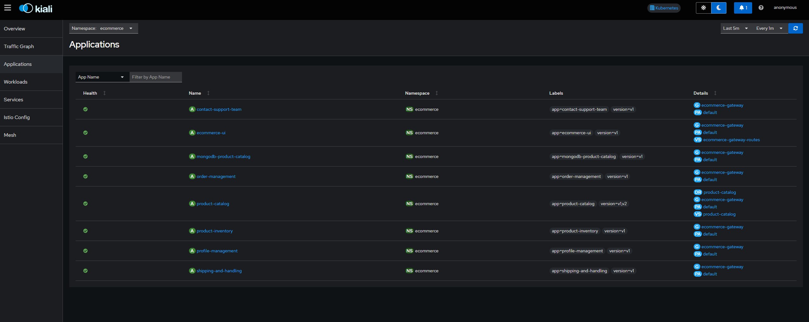
</div>

Genrate trafic and come back to kiali worload.

all traffic passes through the product-catalog gateway. Then 30% are distributed to v2 and 70% to v1 . 

<div align="center">
  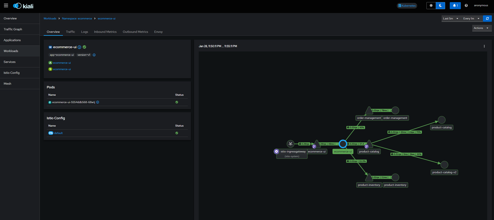
</div>

# 5. Circuit breaking

The circuit breaking allow to manage error during deployment of new version. 

It is like we are still performing canary deployment by adding specific rule.

In this case , we deploy order-management V2 .

Keep in mind that the order-management service selector is “ order-management”. Then, the service will route trafic through all pods with this labels .

```bash
apiVersion: apps/v1
kind: Deployment
metadata:
  name: order-management-v2
  namespace: ecommerce
spec:
  replicas: 1
  selector:
    matchLabels:
      app: order-management
      version: v2
  template:
    metadata:
      labels:
        app: order-management
        version: v2
    spec:
      containers:
      - name: order-management
        image: rslim087/order-management:2.0.0
        ports:
        - containerPort: 9090
        env:
        - name: PRODUCT_INVENTORY_API_HOST
          value: "http://product-inventory"
        - name: PRODUCT_CATALOG_API_HOST
          value: "http://product-catalog"
        - name: SHIPPING_HANDLING_API_HOST
          value: "http://shipping-and-handling"
        # Intentionally omitting the MongoDB connection string
        # This will cause the service to fail when trying to access the database
---
apiVersion: networking.istio.io/v1alpha3
kind: DestinationRule
metadata:
  name: order-management
  namespace: ecommerce
spec:
  host: order-management
  subsets:  #crete group like in canary deployment
  - name: v1
    labels:
      version: v1
  - name: v2
    labels:
      version: v2
  trafficPolicy:  #this section is added to specify circuit breaking . how traffic is target after routing decision is done
    connectionPool: #it is only for example . not a goo practice
      tcp:
        maxConnections: 100 # only 100 user connected , over are rejecti=ed or in pending
      http:
        http1MaxPendingRequests: 10  # only 10 pending , over are rejected
        maxRequestsPerConnection: 10 # 10 requests by connection , over are rejected
    outlierDetection: #how we handle circuit breaking
      consecutive5xxErrors: 5 # if we have 5 consecutitive err on the v2 pod , the pod will be unhealthy and temporary removed, blocking traffic going to ittervale
      interval: 30s "
      baseEjectionTime: 30s #eject
---
apiVersion: networking.istio.io/v1alpha3
kind: VirtualService
metadata:
  name: order-management
  namespace: ecommerce
spec:
  hosts:
  - order-management
  http:
  - route:
    - destination:
        host: order-management
        subset: v1
      weight: 80
    - destination:
        host: order-management
        subset: v2
      weight: 20
```

```bash
trafficPolicy:
  outlierDetection:
    consecutiveErrors: 5
    interval: 30s
    baseEjectionTime: 30s
```

Meaning:

- If a pod returns **5 errors in a row**, it is marked **unhealthy**
- Istio removes it from the load balancer for **30 seconds**
- After that, Istio tests it again

This protects users from faulty deployments.

### Deploy order management V2

```bash
$ kubectl apply -f circuit-breaker-func/
deployment.apps/order-management-v2 created
destinationrule.networking.istio.io/order-management created
virtualservice.networking.istio.io/order-management created
```

Genarate trafic on you browser. You experiment some error. We have these error because some eror

<div align="center">
  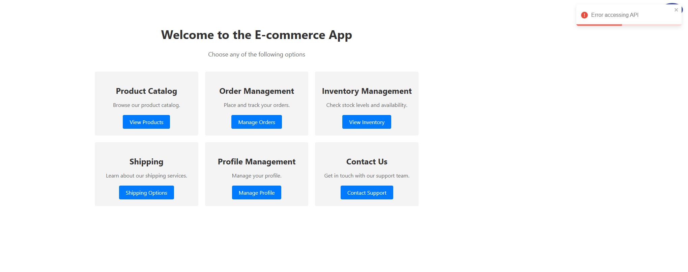
</div>


Go to kiali to watch the workload. we see that the circuit breaker block all the traffic for going to order-management v2.

<div align="center">
  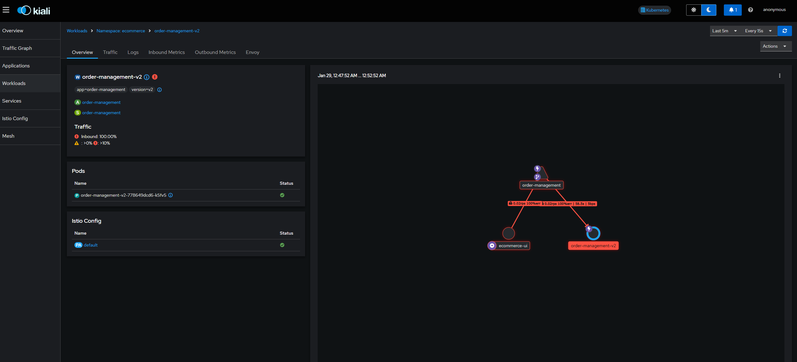
</div>


<div align="center">
  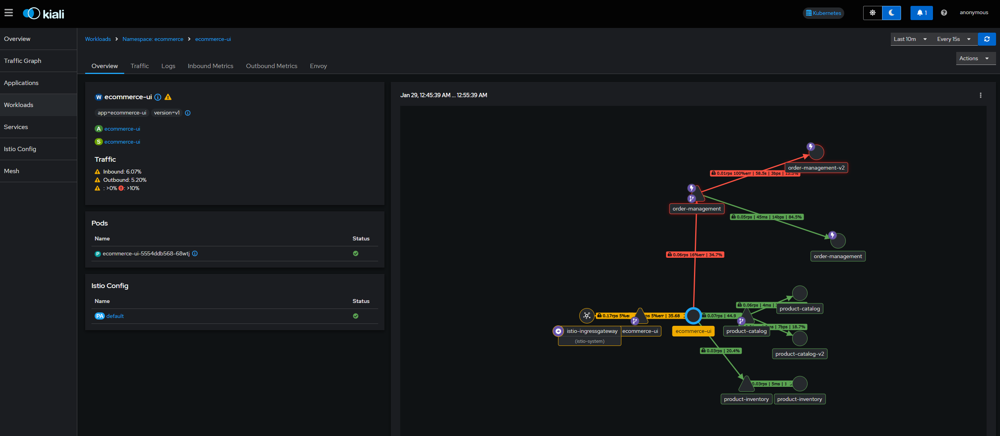
</div>


Now, if you genarate traffic, you won’t get erors because every traffic going to v2 is redirected to v1.

# 6. Monitoring with grafana

```bash
$ kubectl get svc -n istio-system
NAME                   TYPE        CLUSTER-IP      EXTERNAL-IP   PORT(S)                                      AGE
grafana                ClusterIP   10.96.169.206   <none>        3000/TCP                                     163m
istio-ingressgateway   NodePort    10.96.72.176    <none>        15021:30644/TCP,80:30209/TCP,443:30607/TCP   3h12m
istiod                 ClusterIP   10.96.49.44     <none>        15010/TCP,15012/TCP,443/TCP,15014/TCP        3h16m
kiali                  ClusterIP   10.96.249.109   <none>        20001/TCP,9090/TCP                           163m
prometheus             ClusterIP   10.96.209.4     <none>        9090/TCP                                     163m
# port forwarding

$ kubectl port-forward -n istio-system svc/grafana 3000:3000 > /dev/null 2>&1 &

# acces via localhost:3000
```

Go to dasboad. there is a lot of predefine dashboard . you can explore them:

Useful dashboards:

- Istio Mesh Dashboard
- Istio Workload Dashboard
- Istio Service Dashboard
- Istio Performance Dashboard

<div align="center">
  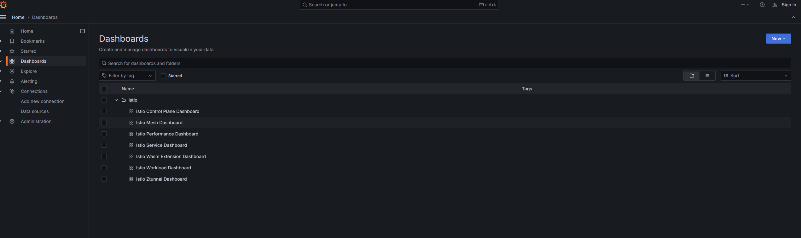
</div>

<div align="center">
  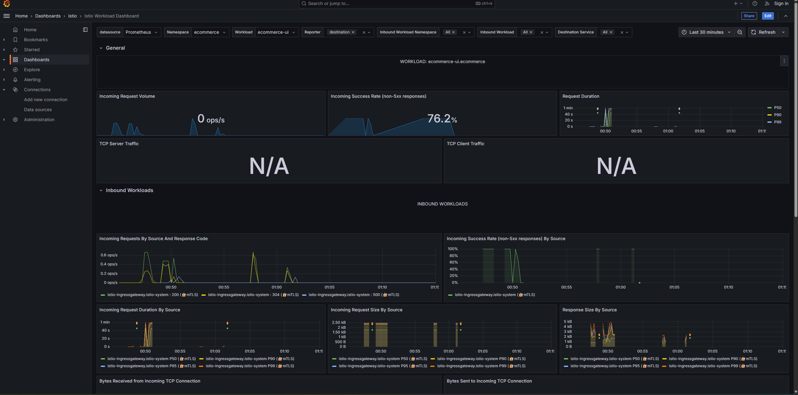
</div>

<div align="center">
  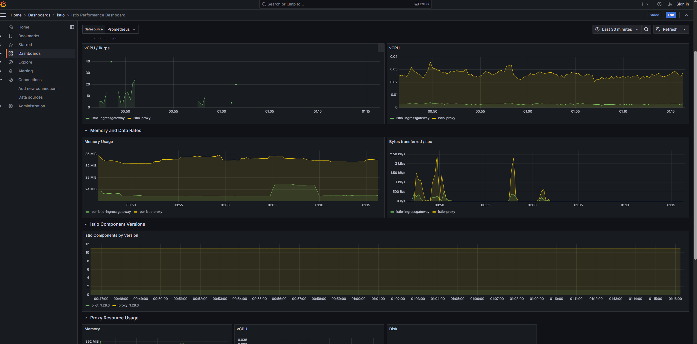
</div>

<div align="center">
  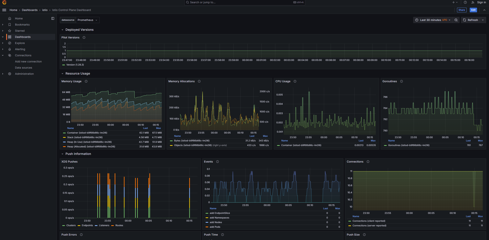
</div>

# 7. Monitoring with jaerger

```bash
#get service
kubectl get svc -n istio-system
NAME                   TYPE        CLUSTER-IP      EXTERNAL-IP   PORT(S)                                          AGE
grafana                ClusterIP   10.96.169.206   <none>        3000/TCP                                         3h45m
istio-ingressgateway   NodePort    10.96.72.176    <none>        15021:30644/TCP,80:30209/TCP,443:30607/TCP       4h13m
istiod                 ClusterIP   10.96.49.44     <none>        15010/TCP,15012/TCP,443/TCP,15014/TCP            4h18m
jaeger-collector       ClusterIP   10.96.208.163   <none>        14268/TCP,14250/TCP,9411/TCP,4317/TCP,4318/TCP   6m
kiali                  ClusterIP   10.96.249.109   <none>        20001/TCP,9090/TCP                               3h45m
prometheus             ClusterIP   10.96.209.4     <none>        9090/TCP                                         3h45m
tracing                ClusterIP   10.96.234.64    <none>        80/TCP,16685/TCP                                 6m
zipkin                 ClusterIP   10.96.189.38    <none>        9411/TCP                 

#port forwarding
kubectl port-forward -n istio-system svc/tracing 8081:80 > /dev/null 2>&1
```

Genarate traffic in you ecommerce app

Open : localhost:8081

if you don’t see your service please refresh the page

<div align="center">
  
</div>

<div align="center">
  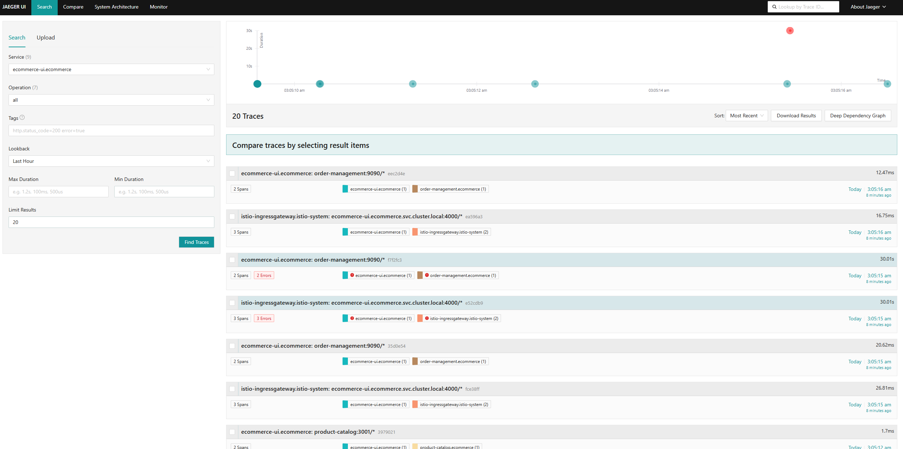
</div>

# Conclusion

This project demonstrates a complete **Istio service mesh** running on a local Kubernetes cluster, including:

- traffic management
- observability
- security
- resilience
- progressive delivery

It is an excellent foundation for learning modern cloud‑native architecture and DevOps practices.